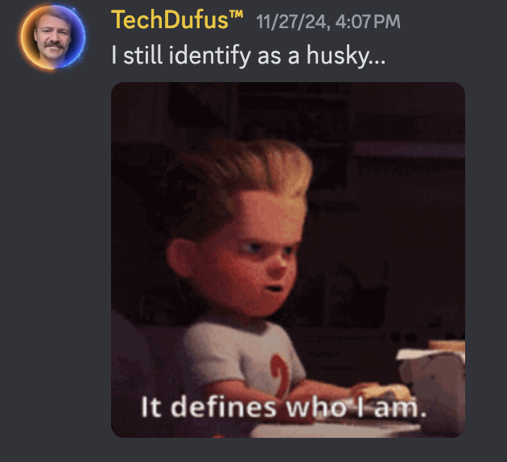
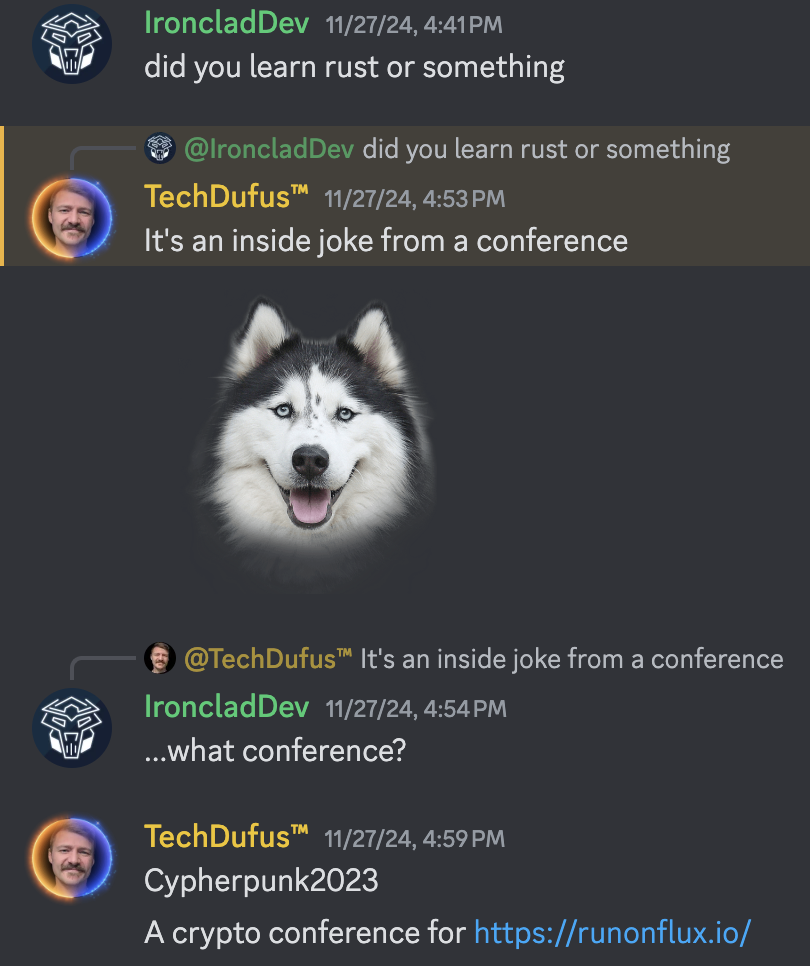

Some internal documents from [TechDufus](https://twitter.com/TechDufus)'s discord server have recently been made public.

Despite appearing extremely based on [X](https://x.com) (formerly Twitter), he openly admits to having identified as a furry for some time.

After answering a few questions from an anonymous reporter, it would appear that it was web3/crypto conference that influenced this devastating disability.

Recently, TechDufus has put a lot of work into his Neovim Configuration and his weight loss journey and has recovered from the incident. According to some sources, he has survived Thanksgiving and managed to not gain an unholy amount of weight like everyone else.

The combination of heavily using Neovim and working out has sparked controversies amongst health experts like [RFK](https://x.com/RobertKennedyJr) and [his mom](https://x.com/RobertKennedyJr) but it's clear that TechDufus is **so back** and on track to be super based again.
