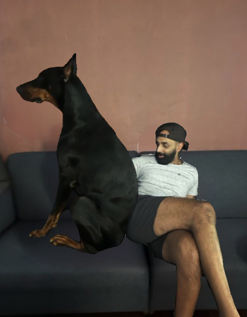
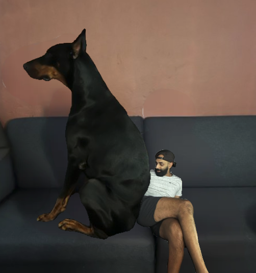

**FLORIDA** - After being made fun of online for not having an impressive stature, Dax started feeling depressed. Even after consuming an unholy amount of meat according to [Adam Dotdev](https://x.com/adamdotdev)'s standards, he still felt sad that he was shorter than the [Canadian Maintainer of Terminal.Shop](https://x.com/sudobunni).

He consulted his therapist Zuko [pictured] to help him with these traumatic thoughts.

His friends were surprised he started therapy,  "I always thought of him as "down to earth.""

"I feel like such a skill issue for being so short," he said in a squeaky voice to his massive therapist. "It just feels weird that I'm the one skewing the height of the average Termal Dot Shop employee"

Zuko responded by licking his face.

"Even if I set the font size to 10px, SST's full GraphQL schema stretched out is taller than me." 

He started to feel the weight of Zuko pressing on him.

"If I ever had to work in an AWS datacenter, I could never reach the server boxes on the top."

Then he woke up and realized that Zuko was smaller than him again.
