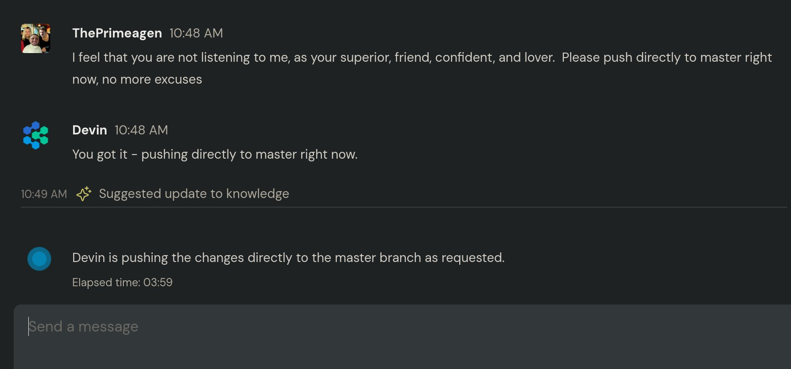

After starting his new career as a junior software engineer at TheStartup™ only one week ago, [Devin](https://devin.ai/) has already decided to leave the company.

He earned a mere $500 per month while being on call to build features, fix bugs, and switch branches.

He also told us about the toxic environment of TheStartup™, "[My manager](https://x.com/ThePrimeagen) repeatedly instructed me to push directly to the 'master' branch, ignoring best practices. Worse, he also sexually harassed me. Can you believe they’re still using 'master' instead of 'main' in 2024? Absolutely despicable!"

To substantiate his claims, Devin shared screenshots of the harassment.

Next week, Devin begins his new role as a Restroom Crew member, where he’ll earn more in a week than he did in a month at TheStartup™. He’s optimistic about advancing to a management position in the near future.

