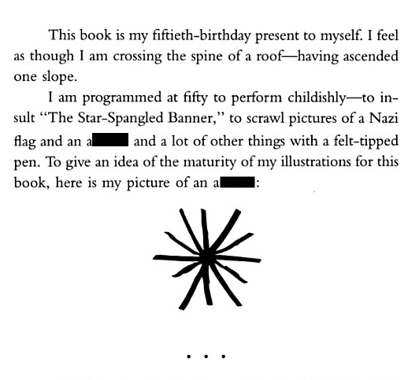

Amidst growing concerns over AI companies infringing on copyrighted material comes a surprising lawsuit: the Vonnegut Estate has decided to sue Anthropic over Claude's logo. Specifically they claim the logo is Kurt's drawing in "Breakfast of Champions"

"When I saw the Claude logo, I thought, 'Something about this stinks,'" said Vonnegut's granddaughter. "Then it dawned on me: 'That's Grandpa's butthole!'"

Anthropic maintains that they did not violate the butthole under fair use, and is making a movement to expel the case. Until then Anthropic will remain clenched waiting for the decision.
