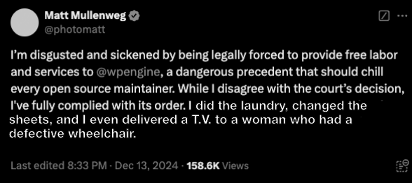

A judge ruled last week that Matt Mullenweg is to become WPEngine's butler because the WordPress founder lacked the funds to pay for damages.

Mullenweg didn't think it was fair that WPEngine was making money off of WordPress, and he wishes he had thought of that.

Later, he took to X to complain about the decision.

Further controversy ensued when some WPEngine employees began flirting with the butler, prompting the WPEngine CEO to send out a memo titled, "He's my butler!" 

Wordpress also had to allow WPEngine back on Wordpress.org proving that Mullenweg is not "master of his domain."
