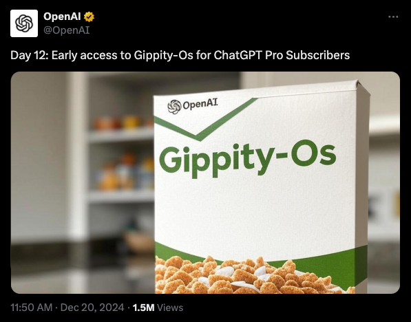

In a recent announcement, OpenAI announced the launch of a new cereal brand called Gippity-Os.

Currently, the cereal is in beta and is only available to ChatGPT Pro Subscribers.

Unfortunately, due to European Regulations, the cereal might not be available to European customers until early 2026.
