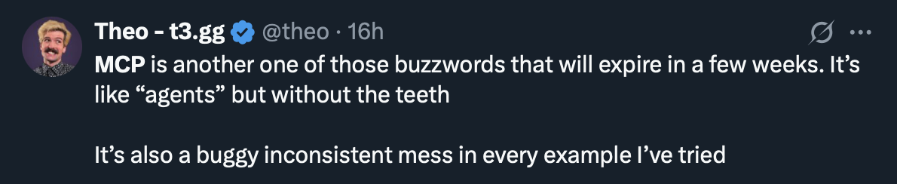

A stunning display of collective posturing: the nation's tech community has spent the last week frantically tweeting about something called the "Model Context Protocol," with a vast majority admitting they have no idea how to actually implement it—or why they should bother.

The trending protocol, which officially standardizes how applications provide context to LLMs—"like a USB-C port for AI applications"—is gaining millions of mentions despite possibly being nothing more than an API wrapper with what sources describe as "extra steps."

"Oh yeah, MCP is revolutionary," says every other tech influencer. "I've been standardizing context across all our LLM systems since, um, Tuesday? Monday? Um, whenever it became cool to mention it."

Meanwhile, prominent developer [Theo](https://x.com/theo) tweeted the following:

"Agents?" "Teeth?"... Hmm, now I'm even more confused.

Anyway, many startups have already begun inserting "MCP" into product descriptions despite there being multiple leaked Slack messages of people desperately asking, "So what does this thing do again?" Three venture capital firms have already invested millions in MCP-focused startups founded by people whose entire technical knowledge consists of bookmarking "expert" Twitter threads, hoping to one day get around to reading them.

Industry experts have declared MCP "a paradigm shift in AI integration" and "potentially the biggest development since the keyboard and mouse," despite not a single one being able to produce a coherent explanation of why it matters. Will unemployed programmers be able to "vibe code" their way out of this one? We don't yet know, and for that we await and hope [Fireship](https://www.youtube.com/@Fireship/videos) will deliver some much-needed clarity—ideally in under 5 minutes.
