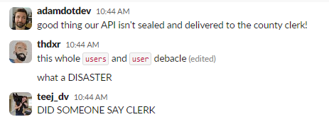
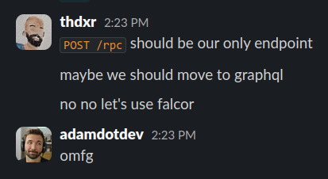

Two full-time employees at [Terminal.Shop](https://terminal.shop) with health insurance benefits paid for by vc funding and your money, have decided to argue over singular vs plural naming conventions for API endpoints in the #general slack channel.

It all started when [Adam Dotdev](https://x.com/adamdotdev), a heckin' chonker of a plantboi, proposed plural naming conventions for API endpoints.

In response to these utterly ridiculous proposals, [t-h-d-x-r](https://x.com/thdxr) (also known as Dax for some reason), proceeded to retaliate.

Despite his best efforts, [Teej Dev Fries](https://x.com/MelkeyDev) has not been able to convince them to reach a decision, even after pouring fuel on the fire.

Teej confirms that in thirty days, nobody will be able to see the conversation unless they pay for slack's [Pro Plan](https://slack.com/pricing) which is really really expensive and nobody really wants to pitch in for that.

Near the end of the fight, Dax threatened to remove Adam from the github organization [[souce]](https://x.com/thdxr/status/1868690187703980168).

In response to this, Adam took one of [Mark Twain](https://uncyclopedia.com/wiki/Mark_Twain)'s quotes [out of context](https://x.com/adamdotdev/status/1868681992088514571) and used it to support his point that plural naming conventions were better.

The final nail in the coffin was when Dax proposed using a single `/rpc` endpoint for all API calls, or switching to [GraphQL](https://orm.drizzle.team/). Adam decided he didn't want to do a lot of refactoring and probably just decided to go with singular API endpoints.

